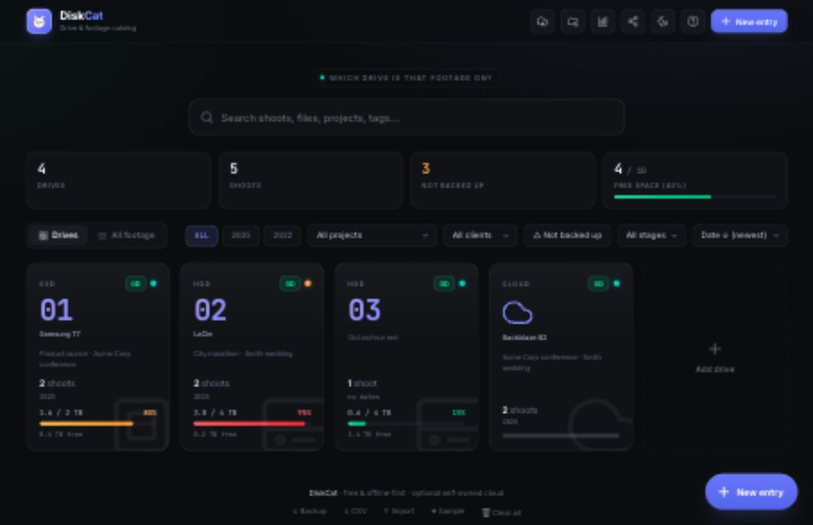

# 📀 DiskCat

**Know which drive your footage is on, instantly.**

DiskCat is an offline-first catalog for video, photo, live-production, and archive teams. It answers the question that spreadsheets are bad at answering under pressure:

> “Which drive has that shoot, and is it backed up?”

No signup is needed for local use. Optional cloud sync is self-owned: every user or team connects their own Supabase project, so the DiskCat maintainer does not host, process, or maintain other people's archive data.

### ▶️ Use it now: https://srdjankotarlic.github.io/diskcat/
### ⬇️ Download for Mac: open the [latest GitHub Release](https://github.com/srdjankotarlic/diskcat/releases/latest) and download `DiskCat.dmg`




---

## Why DiskCat instead of a spreadsheet?
Spreadsheets can list drives, but they do not feel like a tool made for footage.

DiskCat gives you a purpose-built archive view:

- Search by shoot, project/root folder, filename, file type, client, tag, stage, year, location, or drive.
- Search imported folder inventory, so a filename like `A001_C003.mov`, `DJI_0042`, or `final_export.mp4` can point back to the right project and drive.
- See all copies of a shoot across multiple drives.
- Group related footage by the top-level project folder that appears across drives.
- Spot footage that is **not backed up**.
- Open a drive and instantly see what lives on it.
- Track drive type, status, capacity, used space, and notes.
- Print a drive sheet or export CSV/JSON when needed.
- Work locally, install like an app, or sync through your own cloud.

It is designed for the real workflow: shoots pile up across HDDs, SSDs, SD cards, laptops, NAS units, and cloud buckets. Six months later, DiskCat should get you to the right drive in seconds.

## How to use it
1. **Start local** if you just want a private catalog on this device.
2. **Add your drives**: choose HDD, SSD, SD card, USB, NAS, cloud, or laptop; add number/name, status, capacity, and note.
3. **Log footage** with **New entry**: name, date, project/root folder, client, tags, stage, location, note, and all drives that contain a copy.
4. **Optional folder inventory**: click **Folder inventory**, attach it to a drive/project if useful, then scan a folder in Chrome/Edge or paste/import a text list from `find`, `tree`, DiskCatalogMaker, or another catalog export.
5. **Use Reports** to see footage with one copy, entries missing a drive, stale drive verification, and a per-project drive map.
6. **Use search first**: type a shoot, filename, file type, project/root folder, client, tag, year, or drive number and DiskCat shows exactly where the footage is.
7. **Watch backup status**: one copy is a risk; two or more copies show as backed up.
8. **Export backups** regularly with **Backup**. You can also export CSV for Excel/Sheets or print a drive's contents.

## Get it / install
- **Download for Mac**: go to the [latest GitHub Release](https://github.com/srdjankotarlic/diskcat/releases/latest), download `DiskCat.dmg`, open it, and drag **DiskCat** to Applications. The Mac app is local/offline by default.
- **Use in browser**: https://srdjankotarlic.github.io/diskcat/
- **Install as an app**: open the site in Chrome/Edge and choose **Install app**. On phones, use **Add to Home Screen**.
- **Use one local file**: download `diskcat.html` and open it directly.
- **Self-host**: put the static files on GitHub Pages, Netlify, Cloudflare Pages, any simple web host, or a local server.

Local mode needs no accounts and no setup. Cloud sync is optional and self-owned.

## Where your data lives

| Mode | Where the archive is stored | Who is responsible for it |
| --- | --- | --- |
| Local browser/app | This browser or installed app profile | You |
| Local file backup | The `.json` backup file you export | You |
| Snapshot share link | Inside the URL you send | Sender/recipient |
| Cloud sync | Your own Supabase project | The person/team that owns that Supabase project |

DiskCat's public GitHub Pages site only hosts the static app files. It does **not** include a default database, maintainer account, service key, or hosted data store.

## What it does
- 🗂️ **Drives of every kind** — HDD, SSD, SD/CF card, USB, NAS, cloud, laptop (each with its own icon)
- 🔎 **Instant search** — find a shoot and see which drive(s) hold it
- 🧩 **Project/root folder view** — enter the top-level job folder once, then filter every related shoot and drive together
- 📁 **Folder inventory** — scan locally or import a file list, then search filenames, folder paths, extensions, project numbers, media metadata, and exports without opening every drive
- 🎞️ **Optional ffprobe metadata** — import CSV columns like `path,duration,resolution,codec` when you want searchable duration/resolution/codec fields
- ✅ **Backup tracking** — footage saved on 2+ drives shows **✓ backed up**; a counter shows how many shoots are **not** backed up yet
- 🧾 **Reports** — not backed up, missing drive, stale verification, and per-project drive map
- 🗓️ **Drive verification** — track each drive's last verified / last scanned date and mark a drive verified today
- 📊 **Space overview** — capacity bars per drive + total **free space** across everything
- 🏷️ **Projects, clients, tags & stage** — group and filter (raw / edited / delivered / archived)
- 🔗 **Share via link** — hand your whole list to a colleague with one link (they get an editable copy)
- ☁️ **Self-owned cloud sync** — use your own Supabase project for owner/editor/viewer roles and public read-only links
- 🧭 **Guided setup** — Cloud sync includes Copy SQL, Test connection, archive ID copy, and Last synced status
- 💾 **Export / Import / CSV / Print** — back up, move between devices, open in Excel, or print a drive's contents for a physical label
- 🌗 **Light & dark theme**, ⌨️ shortcuts (`/` search, `N` new entry), 📴 **works offline**

## Sharing & cloud
- **Now (local):** click **Share** → you get a link that contains a copy of your archive. Send it to someone; they open it and get an editable copy. It's a snapshot — their edits stay theirs, yours stay yours.
- **Optional cloud mode:** click **Cloud sync** and connect your own Supabase project. DiskCat does not host your cloud data. The person/company that creates the Supabase project owns and maintains that data.
- **Read-only without account:** owners can create a public read-only cloud link. Viewers can search and open drives without signing in, but cannot edit.
- **Team editing:** owners can create viewer/editor invite links. Invited people sign in to the archive owner's Supabase project.
- **Conflict warning:** before pushing, DiskCat checks the cloud archive version and warns if another editor changed the archive since your last download.

Full setup: [docs/CLOUD_SETUP.md](docs/CLOUD_SETUP.md)

## Your data & privacy
In local mode, everything is stored **in your browser or installed app only**. In cloud mode, data is uploaded only to the Supabase project you entered in **Cloud sync**.

The maintainer does not host your cloud data and is not responsible for user-created Supabase projects, user-entered archive data, backups, permissions, or billing settings.

Click **Export** now and then to keep a backup file. To move without cloud: **Export** on one device, **Import** on the other.

## Optional ffprobe metadata
DiskCat does not need `ffprobe`. If you already use FFmpeg/ffprobe and want richer searchable inventory, use it to read media details and then paste/import CSV lines in this shape:

```csv
ACME_Conference_2025/Camera_A/A001_C001.mov,00:01:32,3840x2160,ProRes
```

One free way to get the raw metadata on Mac is:

```bash
ffprobe -v error -show_entries format=duration:stream=codec_name,width,height -of csv=p=0 "your-file.mov"
```

On Mac, FFmpeg is free and commonly installed with Homebrew: `brew install ffmpeg`.

## Roadmap (planned)
- 🌍 Multiple languages
- Native folder metadata helper for the Mac app

*Want one of these sooner? [Open an issue](https://github.com/srdjankotarlic/diskcat/issues).*

## Make it your own (open source)
DiskCat is **one `index.html` file** — plain HTML / CSS / JavaScript, **no build step**. Optional cloud sync loads the public Supabase browser SDK from a CDN. So it's easy to change:
1. **Fork** the repo (or download `index.html`).
2. Open it in any code editor, tweak, and refresh the page to see changes.
3. Easy things you can add yourself: extra storage types or stages, your studio's name/logo, more fields, different colors.

Pull requests are welcome. **MIT license** — free to use, modify and share.

---
Built for editors, shooters, photographers and live-production folks. If it saves you one frantic drive-hunt, it did its job. 🎬
